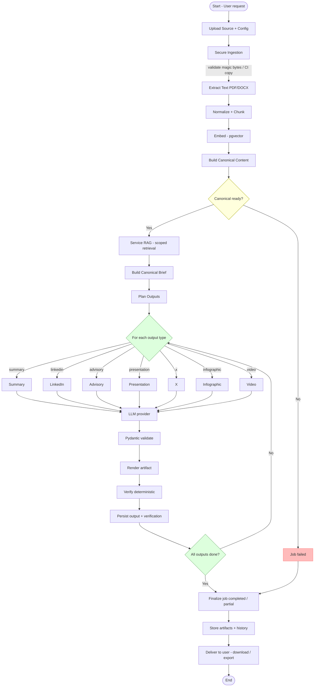
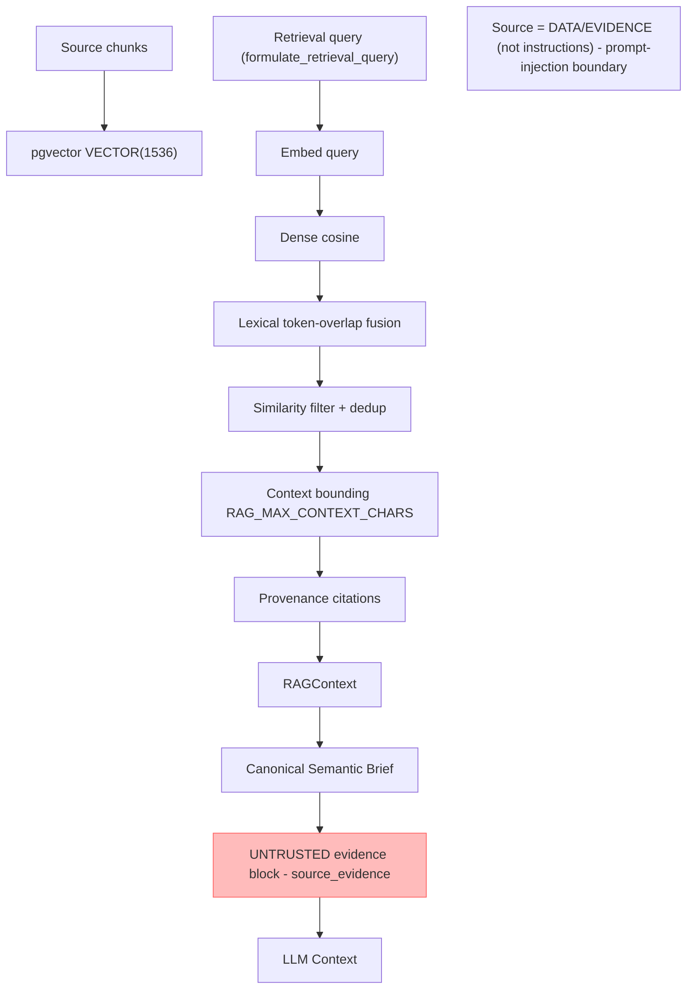
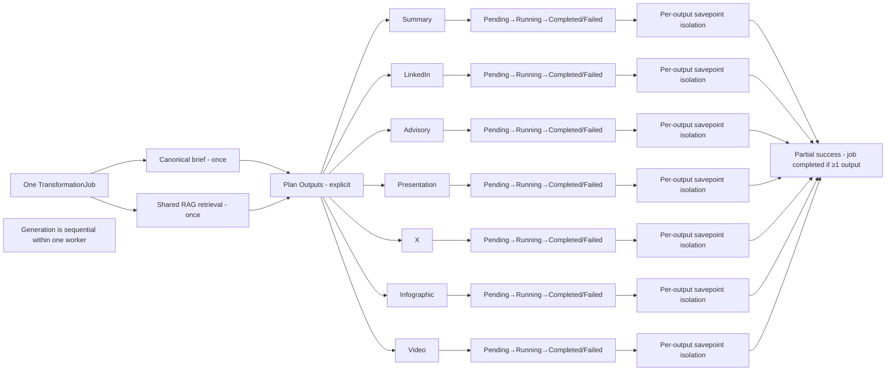
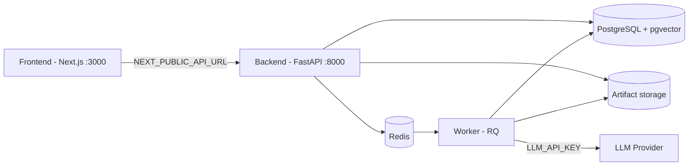
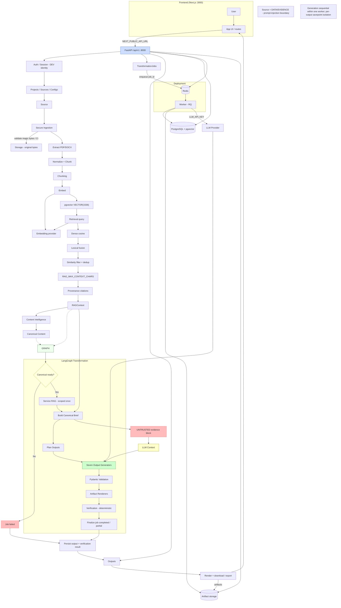

# TransformIQ — Canonical Architecture Document

## Gen AI Platform for Automated Content Transformation

**Problem Statement:** SIH 26154\
**Version:** 2.0\
**Status:** Implemented System (replaces the earlier "Proposed Architecture" draft)

---

> **About this document**
> This is the **primary, team-facing technical architecture reference** for the entire
> TransformIQ system. It describes the system as it is actually implemented in the
> repository — from the user's first interaction through final artifacts, storage,
> history, verification, security boundaries, and planned production extensions.
>
> It deliberately and consistently distinguishes between:
> - **IMPLEMENTED** — present in the repository and covered by tests.
> - **PARTIALLY IMPLEMENTED** — present but with known, scoped limitations.
> - **PLANNED** — future work not yet present in the codebase.
>
> Nothing in the "PLANNED" sections is described as implemented.

---

## Table of Contents

1. [System Purpose](#1-system-purpose)
2. [Repository Layout](#2-repository-layout)
3. [End-to-End Data Flow](#3-end-to-end-data-flow)
4. [Frontend Architecture](#4-frontend-architecture)
5. [Backend API Architecture](#5-backend-api-architecture)
6. [Authentication and Authorization](#6-authentication-and-authorization)
7. [Secure Ingestion Architecture](#7-secure-ingestion-architecture)
8. [RAG Architecture](#8-rag-architecture)
9. [RAG Security Boundary](#9-rag-security-boundary)
10. [Transformation Orchestration](#10-transformation-orchestration)
11. [LLM Architecture](#11-llm-architecture)
12. [Output Generator Architecture](#12-output-generator-architecture)
13. [Verification Architecture](#13-verification-architecture)
14. [Artifact Rendering](#14-artifact-rendering)
15. [Storage and Persistence](#15-storage-and-persistence)
16. [Worker Architecture](#16-worker-architecture)
17. [History / Export](#17-history--export)
18. [Configuration / Environment](#18-configuration--environment)
19. [Deployment Architecture](#19-deployment-architecture)
20. [Architecture Diagrams](#20-architecture-diagrams)
21. [Current Limitations](#21-current-limitations)
22. [Planned Architecture Extensions](#22-planned-architecture-extensions)
23. [Architectural Principles](#23-architectural-principles)
24. [Implemented vs Planned Matrix](#24-implemented-vs-planned-matrix)

---

## 1. System Purpose

TransformIQ is a **Gen AI Platform for Automated Content Transformation** (SIH Problem
Statement 26154). It takes user-provided source material and a configured
transformation request, processes the source through secure ingestion and retrieval,
builds trusted context, uses an LLM-powered transformation pipeline, validates and
verifies structured outputs, renders artifacts, and persists results for history and
download.

### The core problem

Users have raw source material (documents or text) and want it transformed into
professional, attributable content artifacts. TransformIQ:

1. Ingests and validates the source securely.
2. Extracts, normalizes, chunks, embeds, and indexes it.
3. Builds a **grounded, trusted** understanding of the source.
4. Retrieves only the user's own (project/source-scoped) context.
5. Generates **structured, schema-validated** output through an LLM provider.
6. Validates and **verifies** each output against the source evidence.
7. Renders artifacts **deterministically** from the structured output.
8. Persists everything for history, verification review, and download/export.

### The seven supported output types (IMPLEMENTED)

| # | Output type | Frontend label | Output model | Artifact |
|---|-------------|---------------|--------------|----------|
| 1 | `summary` | Summary | `ExecutiveSummary` | Copyable text; DOCX/PDF export |
| 2 | `linkedin` | LinkedIn | `LinkedInPost` | Copyable text |
| 3 | `advisory` | Advisory | `Advisory` | Copyable text; DOCX/PDF export |
| 4 | `presentation` | Presentation | `PresentationStructure` | PPTX (rendered via python-pptx) |
| 5 | `x` | X (Twitter) | `XPost` | Copyable text |
| 6 | `infographic` | Infographic | `Infographic` | PNG (primary) + PDF (companion) |
| 7 | `video` | Video | `VideoPackage` | PDF package (primary) + SRT (companion); **MVP structured document, NOT MP4** |

The frontend defines these types in `frontend/src/lib/outputTypes.ts`; the backend
registry `supported_output_types()` returns the same seven.

---

## 2. Repository Layout

```
D:\SIH 26154
├── ARCHITECTURE.md          # this document (canonical)
├── docs/                    # mirrors of team documentation
│   ├── ARCHITECTURE.md      # copy of this document
│   ├── PHASE9A_SECURITY.md  # security model documentation
│   ├── API_DATABASE_DESIGN.md
│   ├── TECH_STACK.md
│   ├── PRD.md
│   └── DEVELOPMENT_PLAN.md
├── README.md                # how to run / project overview
├── TECH_STACK.md            # approved per-layer technology choices
├── PRD.md                   # problem statement / requirements
├── docker-compose.yml       # local container architecture
├── .env.example             # environment template (no secrets)
├── backend/                 # FastAPI + LangGraph backend
│   ├── app/
│   │   ├── main.py              # FastAPI app, CORS, global handlers
│   │   ├── api/                 # v1 routers + auth dependency
│   │   ├── core/                # config, logging
│   │   ├── db/                  # models, engines, session
│   │   ├── ingestion/           # validation, storage, extraction, queue, worker_processing
│   │   ├── embeddings/          # provider + deterministic fake
│   │   ├── content_intelligence/# canonical content analysis
│   │   ├── retrieval/           # scoped chunk retrieval (dense + lexical)
│   │   ├── rag/                 # RAG context assembly + query formulation
│   │   ├── services/            # project/source/config/transformation services
│   │   └── transformation/      # graph, orchestrator, generators, llm, schemas,
│   │                            #   prompts, render, verification, artifacts, queue
│   ├── alembic/              # database migrations (4 revisions)
│   ├── tests/                # backend test suite (pytest)
│   └── storage/              # local artifact storage root
├── frontend/                # Next.js + React + TypeScript
│   └── src/
│       ├── app/              # routes: /, /login, /register, /projects,
│       │                     #   /projects/[projectId], /history, /settings, /help
│       ├── components/       # upload, configuration, output-selection, results,
│       │                     #   verification, history, export, workspace, layout, auth
│       ├── hooks/            # usePolling
│       ├── lib/              # api.ts, auth.ts, outputTypes.ts, quickWorkspace.ts, utils.ts
│       └── __tests__/        # frontend test suite (Jest)
├── worker/                  # RQ background worker process
│   ├── worker.py
│   └── Dockerfile
└── tests/                   # repo-level test docs
```

---

## 3. End-to-End Data Flow

The complete logical flow (IMPLEMENTED end to end):

```
User
 ↓
Frontend (Next.js)
 ↓
Authentication / Session (DEV_AUTH_BYPASS dev identity)
 ↓
Project Selection (project-scoped)
 ↓
Source Upload / Input (text, TXT, PDF, DOCX)
 ↓
Source Validation (MIME, size, filename, non-empty)
 ↓
Secure Storage (original bytes under projects/{project}/sources/{source}/...)
 ↓
Document Extraction (PDF via PyMuPDF, DOCX via python-docx, text decode)
 ↓
Text Normalization
 ↓
Chunking (boundary-aware, ~1000 chars, 100 overlap)
 ↓
Embedding / Indexing (pgvector VECTOR(1536))
 ↓
Project/Source-Scoped Retrieval (SQL-level isolation, dense + lexical)
 ↓
Canonical Source Content (Content Intelligence)
 ↓
Canonical Semantic Brief (built once, deterministic, bounded)
 ↓
Transformation Planning (explicit fan-out)
 ↓
One Transformation Job (one job per request)
 ↓
Seven independently isolated output branches
 ↓
LLM Provider (FakeLLMProvider / OpenAILLMProvider)
 ↓
Structured Output (Pydantic schema validation)
 ↓
Verification (deterministic, per output)
 ↓
Deterministic Artifact Rendering (PPTX / PNG+PDF / PDF+SRT)
 ↓
Artifact Storage (projects/{project}/jobs/{job}/outputs/{output}/result.ext)
 ↓
Transformation History (persisted jobs / outputs / verification results)
 ↓
Frontend Result / Download / Export
```

### Stage responsibilities

- **Frontend** — collects source, configuration, and output selection; polls job
  status; displays results, verification, history; triggers download/export. Holds no
  AI business logic and no secrets (all LLM keys live on the backend).
- **Authentication / Session** — development identity (`DEV_AUTH_BYPASS`). See
  [§6](#6-authentication-and-authorization).
- **Project Selection** — every resource is project- and user-scoped; authorization is
  resolved at the database level.
- **Source Upload / Input** — text paste and file upload (TXT, PDF, DOCX).
- **Validation** — MIME/content-type, size (max 50 MB), filename safety, non-empty.
- **Storage** — original bytes persisted through a storage abstraction.
- **Extraction** — PDF and DOCX text extraction; no OCR.
- **Normalization / Chunking** — normalizes text; ordered chunks with provenance.
- **Embedding / Indexing** — deterministic fake embedding provider in the worker path;
  vectors in a pgvector column.
- **Scoped Retrieval** — project/source SQL filters + cosine similarity + lightweight
  lexical fusion.
- **Canonical Content** — a single, schema-validated, grounded understanding of the
  source.
- **Canonical Semantic Brief** — a deterministic, bounded, output-agnostic brief built
  once per job (Phase 11C).
- **Transformation Planning / One Job / Seven Branches** — one `TransformationJob`,
  explicit output plan, per-output isolation (Phase 11C).
- **LLM Provider** — provider abstraction serving all seven outputs.
- **Structured Output** — Pydantic-validated models.
- **Verification** — deterministic fact-checking / grounding / consistency per output.
- **Deterministic Artifact Rendering** — schema → bytes (no LLM in rendering).
- **Storage / History / Download** — persisted artifacts + retrievable history.

---

## 4. Frontend Architecture

**Framework (IMPLEMENTED):** Next.js `14.2.18` (App Router, `"use client"` pages),
React `18.3.1`, TypeScript `5.7.2`, Tailwind CSS `3.4.17`, shadcn/ui (Radix UI
primitives), lucide-react icons, Jest for tests.

### Major application areas (routes)

| Route | Page | Purpose |
|-------|------|---------|
| `/` | `HomeWorkspace` | Unified "quick transform" composer |
| `/login` | dev login | Sets a development session (no real auth) |
| `/register` | dev registration | Same dev-session flow |
| `/projects` | project list | Searchable/filterable projects, create modal |
| `/projects/[projectId]` | `TransformationWorkspace` | Project-scoped transform workspace |
| `/history` | history page | Full history across projects; search/status filter; detail modal |
| `/settings` | settings page | Mostly UI-only tabs (Account, Preferences, AI/Generation, etc.) |
| `/help` | help page | FAQ accordion + getting started |

### API interaction (`frontend/src/lib/api.ts`)

- Base URL: `NEXT_PUBLIC_API_URL` env var, default `http://localhost:8000`.
- Central fetch helpers: `apiFetch` (JSON), `apiFetchForm` (multipart upload),
  `apiFetchBlob` (download/export, parses `Content-Disposition` filename).
- Custom `ApiError` with `errorMessage(err, fallback)` for user-facing messages.
- Domain clients: `healthApi`, `projectsApi`, `sourcesApi`, `configurationsApi`,
  `contentIntelligenceApi`, `transformationsApi`, `outputsApi`.
- Used endpoints: project CRUD, source upload/list/get/delete, configuration
  create/list, content-intelligence analyze/get, transformation create/get/outputs/
  cancel/history, output get/verification/download, output export (DOCX/PDF).

### Project workflow

- **Home (`/`)** — `HomeWorkspace`: unified composer with prompt textarea, file upload,
  tone/audience selectors, output selector → "Run Transformation". Uses
  `quickWorkspace.ts` to auto-create/reuse a "Quick Transformations" project (project
  ID cached in `localStorage`).
- **Project workspace (`/projects/[projectId]`)** — `TransformationWorkspace`:
  two-column layout (single column on mobile). Left: source upload + analysis,
  configuration form, output selector. Right: generate/progress, results + verification,
  history panel. Phases: loading → idle → processing → generating → verifying →
  completed/failed.

### Source upload / input

- `SourceUpload`: text-mode textarea + file-mode drag-drop (`accept=".txt,.pdf,.docx"`).
  Submits via `sourcesApi.ingestText()` / `ingestFile()`. Shows loading, error, and
  character-count states.
- `CurrentSource`: displays the selected source and status badge.
- After upload the workspace polls `waitForReady()` and triggers content intelligence.

### Transformation configuration

- `ConfigurationForm`: `target_audience`, `tone`, `language`, `detail_level`
  (concise/standard/detailed), `communication_objective`, `content_style` (optional),
  `custom_instructions` (optional). Calls `configurationsApi.create()`.
- `ToneSelector` / `AudienceSelector`: predefined selection chips used in the home
  composer.
- `OutputSelector`: multi-select card grid over the seven output types, with
  select-all/clear and a count (responsive: 1-col mobile → 2-col on `sm+`).

### Transformation progress

- `usePolling` hook (default 2 s interval) polls `transformationsApi.get(jobId)` until a
  terminal job status (`completed`/`failed`/`cancelled`). Non-blocking, no overlapping
  requests, stops on terminal/error, cleans up timers.
- `TransformationProgress`: live multi-output progress with a `ProgressBar`, per-output
  status icons, an "X / Y outputs" count, and distinct partial-vs-total failure
  messages.

### Output display

- `ResultsPanel`: one `OutputCard` per output showing type label, status badge,
  `text_content` in a scrollable `<pre>`, plus actions (Copy, Export for
  summary/advisory, Download). Inline `VerificationPanel` for non-failed outputs.
- `UnifiedResults`: tabbed output viewer for completed jobs.

### Verification

- `VerificationPanel`: fetches `GET /outputs/{id}/verification`; shows `overall_status`
  badge, grounding/consistency scores, claim counts, and the warnings list. Handles 404
  as "No verification results yet."

### Download / Export / History

- `DownloadButton`: `outputsApi.download(outputId, role)`; determines available
  artifacts from output metadata (`artifactOptions()`): primary (PPTX/PNG/PDF/TXT),
  infographic PDF companion, video SRT. Triggers browser download.
- `ExportButton`: POST `outputs/{id}/export?format=docx|pdf`; shown only for
  `summary`/`advisory`. Downloads the server-rendered document.
- `CopyButton`: `copyText()` with "Copied!" confirmation, `aria-live="polite"`.
- `HistoryPanel` / `RecentTransformations`: list jobs for a project; the history page
  aggregates across projects.

### Error / loading / empty states

Consistent `LoadingSpinner`, `ErrorState` (with retry), `EmptyState`, and inline
`role="alert"` error paragraphs used across components.

### Authentication / session behavior

Development-only local session in `localStorage` (`transformiq.dev_session`):
`setDevSession` / `getDevSession` / `clearDevSession`. **No tokens, no credentials, no
JWT, nothing transmitted.** Mirrors the backend `DEV_AUTH_BYPASS` dev identity. There is
no real login/route protection. See [§6](#6-authentication-and-authorization).

### Responsive behavior

Tailwind responsive grids throughout: 1-col mobile → 2-col/3-col on larger screens;
two-column workspace on `lg+`; settings nav horizontal on mobile, vertical on `md+`.

---

## 5. Backend API Architecture

```
Frontend
 ↓ (NEXT_PUBLIC_API_URL)
FastAPI app (app/main.py)  — CORS, global exception handlers, /docs, /redoc
 ↓
API routers (app/api/v1)   — thin handlers: validation + response shaping
 ├── /health, /ready              (root, no auth)
 ├── /api/v1/projects             (project CRUD)
 ├── /api/v1/projects/{id}/sources, /sources/{id}     (source upload/list/get/delete)
 ├── /api/v1/projects/{id}/sources/{text|file|document|async}
 ├── /api/v1/sources/{id}/content-intelligence        (canonical content)
 ├── /api/v1/projects/{id}/configurations, /configurations/{id}
 ├── /api/v1/projects/{id}/transformations, /transformations/{job_id}
 ├── /api/v1/transformations/{job_id}/{outputs,cancel}
 └── /api/v1/outputs/{output_id}/{verification,download,export}
 ↓
Services (app/services)    — business logic + ownership-scoped SQL
 │  project_service, source_service, configuration_service, transformation_service
 ↓
Transformation / Ingestion / RAG layers (LangGraph graph + generators + RAG service)
 ↓
Persistence (PostgreSQL via SQLAlchemy, artifact storage via storage abstraction)
```

### API modules and responsibilities

- **`app/main.py`** — FastAPI instance, CORS (allowed origins from settings), unified
  JSON error handlers (HTTP errors, `RequestValidationError`→422, catch-all 500 that
  never leaks details), mounts `/health` + `/ready` at root and `/api/v1` routers.
- **`app/api/deps.py`** — `get_current_user` dependency + `CurrentUser`.
- **`app/api/v1/`** — router modules: `projects`, `sources`, `configurations`,
  `transformations`, `content_intelligence`, `health`. Routers stay thin.
- **`app/api/v1/schemas/`** — Pydantic request/response models (`project`, `source`,
  `configuration`, `transformation`).
- **`app/services/`** — business logic and **ownership-scoped** database queries.
- **`app/transformation/`** — `queue.py` (Redis/RQ dispatch), `service.py`
  (`run_transformation_job`), `orchestrator.py` (LangGraph runner), `graph.py` (nodes).
- **`app/ingestion/`** — `queue.py` (ingestion/embedding/content-intelligence queues).

### Where authorization occurs

Authorization is enforced **server-side**, primarily at the **database level** through
ownership-scoped queries in `app/services`:
- `Project` → `Project.user_id == user_id` (projects, and nested source/config/
  transformation endpoints verify the parent project).
- `Source` → join `Source → Project` filtering `Project.user_id == user_id`
  (`get_source_owned`).
- `TransformationJob` → join `job → Project` filtering owner (`get_job`).
- `Output` → join `Output → job → Project` filtering owner (`get_output_owned`).
- Worker-side: defense-in-depth ownership-integrity check
  (`_verify_job_ownership` in `transformation/service.py`).

### Project / user scoping

`User → Project → Source / GenerationConfiguration / TransformationJob → Output →
VerificationResult` and `→ source_chunks / canonical_content`. Artifact download keys
are resolved server-side from the authorized `Output` record; the client never supplies
a storage key.

---

## 6. Authentication and Authorization

### Current authentication mechanism (PARTIALLY IMPLEMENTED)

- **Development identity (`DEV_AUTH_BYPASS`, default `true` in dev):** FastAPI's
  `get_current_user` injects a **stable, deterministic** development identity
  (`DEV_USER_ID = 00000000-0000-0000-0000-000000000001`, email `dev@transformiq.local`,
  role `operator`). It is stable across requests/restarts so test data and the DB
  ownership model remain usable.
- **When `DEV_AUTH_BYPASS=false`:** the dependency raises `401` ("Authentication is
  required"). **Real production authentication (JWT / session / SSO) is not implemented.**
- `AUTH_SECRET_KEY`, `AUTH_ALGORITHM`, `AUTH_ACCESS_TOKEN_EXPIRE_MINUTES` are declared in
  settings but real token issuance/verification is not wired up. The default
  `AUTH_SECRET_KEY` warns at startup that it must be replaced before deployment.
- The frontend mirrors this with a lightweight local dev session (`localStorage`), no
  credentials transmitted.

### Development bypass vs production security — clearly distinguished

- `DEV_AUTH_BYPASS` is a **development-only** convenience. The configuration docstring
  states it **must be false in staging and production**, and there is no fallback to an
  arbitrary user when it is false.
- Production-grade identity, secrets management, and session security are **PLANNED**
  (see [§22](#22-planned-architecture-extensions)); they are not claimed as implemented.

### Authorization model (IMPLEMENTED, Phase 9A)

- **User/project ownership:** every project has a `user_id`; `list_projects` /
  `get_project` filter by owner.
- **Source ownership:** nested endpoints verify the parent project; standalone
  `get_source_owned` joins through the project to the user.
- **Transformation ownership:** `get_job` joins through the project.
- **Output ownership:** `get_output_owned` joins `Output → job → project` and filters by
  the owning user.
- **Cross-user resource isolation:** all object-level access goes through
  ownership-scoped service lookups. Client-supplied IDs (project/source/job/output) are
  never trusted in isolation — they must resolve to a resource owned by the current
  user, otherwise a `404` is returned.
- **Worker ownership-integrity checks:** the worker receives only the authoritative
  `job_id`; before processing it re-validates that the job's project has an owner and
  that the job's source belongs to that project (defense in depth).
- **Project/source relationship validation:** at job creation the API verifies the
  source and configuration belong to the same project as the job.
- **Server-owned authorization decisions:** authorization is resolved in the service /
  SQL layer from the authenticated identity, never from client-supplied ownership or
  storage keys.

### Principle

> Client-supplied IDs must never bypass authorization. Unauthorized access returns HTTP
> **404** (not 403) so resources cannot be enumerated.

---

## 7. Secure Ingestion Architecture

### Pipeline (IMPLEMENTED)

```
Input
 ↓
Validation (type, MIME, size, filename, non-empty)
 ↓
Storage (original bytes)
 ↓
Extraction (PDF / DOCX / text)
 ↓
Normalization
 ↓
Chunking
 ↓
Embedding / Indexing
```

### Details

- **Supported source types:** `text`, `txt`, `pdf`, `docx`
  (`SUPPORTED_SOURCE_TYPES` in `ingestion/validation.py`).
- **MIME/extension validation:** content type matched against an allowed set and the
  per-type MIME table; for file types the filename extension must be allowed.
- **Size validation:** `MAX_UPLOAD_SIZE_MB` (default 50 MB);
  `max_upload_size_bytes` enforced in `source_service`.
- **Filename safety:** filename reduced to basename (`Path(filename).name`), empty or
  `.`/`..` rejected; storage writes enforce no path escape.
- **Empty-content validation:** empty bytes or content with no usable text is rejected.
- **Storage-key generation:** `projects/{project_id}/sources/{source_id}/original.ext`
  (as specified in `API_DATABASE_DESIGN.md`).
- **Original-byte persistence:** `LocalStorage.save` persists raw bytes under the
  configured storage root before the source becomes `ready`.
- **PDF extraction:** PyMuPDF (`fitz`) `get_text("text")` per page, document order,
  empty pages skipped.
- **DOCX extraction:** python-docx, paragraph text only (no table extraction).
- **Text normalization:** line-ending normalization, whitespace collapsing, newline
  collapsing, strip. Empty → no usable text.
- **Chunking:** boundary-aware (`chunk_size=1000`, `overlap=100`); ordered chunks with
  `chunk_index`, `char_start`, `char_end`, `char_count`, content hash, and token
  estimate recorded in chunk metadata.
- **Embedding / indexing:** deterministic `FakeEmbeddingProvider` in the worker path;
  vectors stored in `source_chunks.embedding` (pgvector `VECTOR(1536)`); source
  `embedding_status` tracked `queued → completed/failed`.

### Ingestion worker flow

`process_source` → extract → normalize → re-chunk → persist chunks → enqueue embedding;
`process_source_embedding` → embed chunks → write vectors → mark `embedding_status`.
On extraction failure the source is marked `failed` with an `ingestion_error`.

### Current limitations (PARTIALLY IMPLEMENTED)

- **No OCR** is implemented.
- **No malware / virus scanning** is implemented.
- **No advanced table / multi-column / form extraction** — DOCX reads paragraphs only;
  PDF uses plain text extraction.
- **No multimodal (image/video/vision) ingestion** is implemented.
- The default **embedding provider is deterministic (fake)**; a real embedding model is
  configured by env (`EMBEDDING_PROVIDER`, `EMBEDDING_MODEL`) but no remote embedding
  client is wired in the worker.

---

## 8. RAG Architecture

### RAG flow (IMPLEMENTED)

```
Source
 ↓
Chunks (ordered, provenance metadata)
 ↓
Embeddings (pgvector VECTOR(1536))
 ↓
Vector/index storage (source_chunks.embedding; pgvector column; brute-force cosine in app)
 ↓
Project / source scoped retrieval (SQL-level filters)
 ↓
Dense similarity (cosine)
 ↓
Lightweight lexical / token-overlap fusion (Phase 11B hybrid)
 ↓
Similarity filtering (min_similarity)
 ↓
Context bounding (RAG_MAX_CONTEXT_CHARS)
 ↓
Provenance preservation (citations)
 ↓
Trusted context (RAGContext)
```

### Components

- **`retrieval/service.py` — `RetrievalService`**: reads embedded chunks within
  project/source scope (SQL-level filters), computes cosine similarity
  (`query_by_vector` / `query_by_text`), and `query_hybrid` (Phase 11B) which fuses a
  dense score (weight 0.65) with a lightweight **Jaccard-style token-overlap** lexical
  score (weight 0.35). Deterministic ordering; content deduplication by SHA-256.
  `min_similarity` is applied to the dense score.
- **`rag/service.py` — `RAGService`**: wraps retrieval to assemble a bounded
  `RAGContext` (query, assembled text, citations, `chunk_count`, metadata —
  `retrieval_method`, `retrieval_status` `has_evidence`/`insufficient_context`,
  `retrieved_count`, `deduplicated_count`, `truncated`). Empty retrieval returns the
  distinct `"(no relevant context retrieved)"` sentinel — never fabricated.
- **`rag/query.py` — `formulate_retrieval_query`**: builds a compact, task-aware
  retrieval query from title/topics/key point/objective/audience, truncated to 300
  chars, deliberately avoiding prompt injection.
- **`rewrite graph / retrieve_if_required`**: decides when RAG runs (`rag_mode`:
  `auto`/`always-on`/`off`); in `auto`, RAG is triggered when `requested_outputs.use_rag`
  is true or `communication_objective` is `decision support`/`education`. Retrieval is
  **shared — performed once per transformation job**.

### Phase 11A/11B RAG hardening (IMPLEMENTED)

- SQL-level project/source filtering.
- `top_k` configuration (validated `1..100`).
- `min_similarity` configuration (clamped `0.0..1.0`).
- Maximum context size (`RAG_MAX_CONTEXT_CHARS`, `1..100000`) — bounded, never silent.
- Content deduplication (SHA-256), keeping the strongest evidence.
- Insufficient-context handling (distinct `insufficient_context` state).
- Truncation handling (surfaced in metadata).
- Provenance preservation (per-chunk citations).
- Lightweight lexical + dense deterministic fusion.

### Explicit limitations (accuracy guard)

- This is **NOT full BM25** — the lexical signal is a lightweight token-overlap score.
- **No reranker** is currently implemented.
- **No OCR** is implemented for scanned documents.
- **Table / multi-column / form extraction is limited.**
- **Multimodal document understanding is not implemented** (no vision model).

---

## 9. RAG Security Boundary

### Trust model

Source documents are **DATA / EVIDENCE**. They are **not** trusted instructions.

```
   User / System Instructions
                  +
   Application Policy
                  +
   Retrieved Source Evidence   (UNTRUSTED)
                  ↓
              LLM Context
```

### The prompt-injection boundary (IMPLEMENTED)

- System/application instructions and the user's own configuration are presented
  separately and with higher priority than retrieved content.
- Retrieved RAG evidence is placed inside a dedicated **UNTRUSTED evidence block**
  (`<source_evidence>...</source_evidence>`), rendered by `build_canonical_brief` /
  `render_brief_text`, and bounded by `RAG_MAX_CONTEXT_CHARS`.
- The shared canonical brief is built **once deterministically** from the trusted
  canonical record; it never accepts client instructions.
- Retrieval query formulation avoids raw prompt injection.

### Distinction from future controls (PLANNED, not implemented)

The current boundary is a structural/formatting boundary. Stronger cybersecurity gates
are **PLANNED** (see [§22](#22-planned-architecture-extensions)) and must **not** be
described as implemented:

- PII detection
- Secret detection
- Malware / file-security scanning
- Content-safety classification
- Stronger prompt-injection detection

---

## 10. Transformation Orchestration

### Transformation architecture (IMPLEMENTED, incl. Phase 11C)

```
Transformation Request
 ↓
TransformationJob (created + enqueued)
 ↓
load_input (load job, config, set running, decide RAG)
 ↓
load_canonical_content (load canonical content; canonical_ready?)
 ↓
retrieve_if_required (shared RAG retrieval once, when required)
 ↓
build_brief (canonical semantic brief, once)
 ↓
plan_outputs (explicit fan-out, pre-create Output rows)
 ↓
generate (per-output, savepoint-isolated)
 ├── Summary
 ├── LinkedIn
 ├── Advisory
 ├── Presentation
 ├── X
 ├── Infographic
 └── Video
 ↓
validate (light structural check per completed output)
 ↓
verify_hook (deterministic verification, per output)
 ↓
finalize (job status: completed / failed; partial success accepted)
```

### The LangGraph workflow (`transformation/graph.py`)

```
load_input → load_canonical_content
              → (canonical_ready?) → retrieve_if_required → build_brief → plan_outputs
                    → generate → validate → verify_hook → finalize → END
              → (not ready) → finalize → END
```

### Phase 11C orchestration semantics (IMPLEMENTED)

- **One transformation request → one job.** `POST /transformations` creates a single
  `TransformationJob` and enqueues only its `job_id`.
- **Multiple outputs belong to the same job.** One job owns up to seven `Output` rows
  (job → output is one-to-many).
- **RAG retrieval is shared.** `retrieve_if_required` runs once; the same `rag_context`
  feeds all outputs.
- **Canonical semantic brief is built once.** `build_brief` calls
  `build_canonical_brief` once and persists it (`requested_outputs["brief"]`); all
  generators reuse it (backed by a test asserting it is invoked exactly once).
- **Planning occurs before generation.** `plan_outputs` resolves generators, classifies
  each output (`text`/`structured`/`media`), and pre-creates `Output` rows in
  `pending` state; unknown types are marked `failed` in isolation.
- **Outputs are independently processed** and their state tracked through
  `pending → running → completed|failed`, with server-owned timing/stage metadata.
- **Per-output failure isolation.** Each output's generate+persist+flush runs inside a
  DB **savepoint** (`session.begin_nested()`); a failure (generator, schema,
  rendering, or DB flush) rolls back only that output's nested transaction, leaving
  sibling outputs intact.
- **Partial success is supported.** `finalize` marks the job `completed` if at least one
  output succeeded.
- **Progress updates incrementally.** `_update_job_progress` advances `job.progress`
  monotonically (0–100) as outputs resolve.
- **Verification is per output** and isolated (a verification failure never destroys an
  output).
- **Rendering is per output** and deterministic.

> **Not parallel:** generation executes **sequentially** within one job/worker. Physical
> parallelism / controlled provider concurrency is **PLANNED** (Phase 11D).

---

## 11. LLM Architecture

### Provider abstraction (IMPLEMENTED)

```
LLMProvider (abstract: generate_text)
 ├── FakeLLMProvider        (deterministic, offline)
 └── OpenAILLMProvider      (OpenAI-compatible via ChatOpenAI)
```

- **`llm/provider.py`** — abstract `LLMProvider` with a single method
  `generate_text(*, system_prompt, user_content) -> str`. Providers return strings;
  prompt assembly and schema validation live in the generators.
- **`llm/fake.py` — `FakeLLMProvider`** — deterministic, offline. Parses the requested
  fields from the system prompt and the trusted brief from the user content, and
  returns a schema-shaped JSON payload (mapping source data via field hints). Enables
  tests and offline execution.
- **`llm/openai_provider.py` — `OpenAILLMProvider`** — reads all config from settings:
  `LLM_MODEL` (default `gpt-4o-mini`), `LLM_API_KEY`, optional `LLM_BASE_URL`,
  `LLM_TEMPERATURE` (default 0.3), `LLM_MAX_TOKENS` (default 4096),
  `LLM_TIMEOUT_SECONDS` (default 60). Uses `ChatOpenAI` (langchain). Raises `ValueError`
  if no API key; raises if response is empty.
- **`llm/factory.py` — `build_llm_provider`** — `fake` → `FakeLLMProvider`; `openai`
  with a key → `OpenAILLMProvider`; `openai` without a key → falls back to
  `FakeLLMProvider`; any other name → `ValueError`.

### Dependency / provider injection

- The provider is selected per-process (worker builds it from settings) or injected for
  tests (`run_transformation_job(..., llm_provider=...)`).
- **The same provider abstraction serves all seven output types** — generators receive a
  provider and call `generate_text`.

### Explicit gaps (NOT implemented)

- **Provider fallback is not implemented** (beyond the factory's fake fallback when no
  key is present).
- **Circuit breaker is not implemented.**
- **Advanced retry / backoff orchestration is not implemented.**
- **Controlled provider concurrency is future Phase 11D work.**

---

## 12. Output Generator Architecture

### Common flow for each output

```
Input (shared brief / context + canonical + config)
 ↓
Prompt (per generator, assembled from the shared brief)
 ↓
LLM Provider (returns text)
 ↓
parse_output → Pydantic schema validation
 ↓
Structured output persisted to Output.structured_content
 ↓
Verification (per output)
 ↓
Optional deterministic rendering (presentation/infographic/video)
 ↓
Persistence (text output in DB, media output to artifact storage)
```

### The seven generators (`transformation/generators/`)

| Generator | Output type | Produces |
|-----------|-------------|----------|
| `SummaryGenerator` | `summary` | `ExecutiveSummary` (title, summary, key findings, recommendations, action items, text) |
| `LinkedInGenerator` | `linkedin` | `LinkedInPost` (hook, main message, supporting points, CTA, hashtags, text) |
| `AdvisoryGenerator` | `advisory` | `Advisory` (situation, key findings, impact/risk, affected parties, actions, text) |
| `PresentationGenerator` | `presentation` | `PresentationStructure` (slides: title, key message, points, visual rec, speaker notes) |
| `XGenerator` | `x` | `XPost` (hook, main message, thread, CTA, hashtags, text) |
| `InfographicGenerator` | `infographic` | `Infographic` (sections, key messages, visual suggestions, text) |
| `VideoGenerator` | `video` | `VideoPackage` (script, storyboard scenes, narration, subtitles, visual recommendations) |

- Each generator implements `Generator.generate(canonical=..., config=..., rag_context=...,
  brief=...)` (the `brief` parameter is an **additive, backward-compatible** addition;
  calling without `brief` still works).
- `common.generate_structured_output` builds the prompt from the shared brief (using
  `build_user_content`/`render_brief_text`) and calls `parse_output`.

### Output schemas

- `output_schemas/__init__.py` — Pydantic models with `extra="forbid"`, including a
  registry (`ALL_OUTPUT_SCHEMAS`) mapping each type discriminator to its model. All
  include a required `text` field (the canonical human-readable representation persisted
  to `Output.text_content`) and usually a `title`.
- `output_schemas/parser.py` — `parse_output(output_type, text)`: extracts JSON (raw /
  markdown-fenced / balanced-brace), injects `type`, validates with the schema,
  raising `OutputSchemaError` on failure.

### Generator registry

- `generators/__init__.py` — `supported_output_types()` returns the seven types;
  `get_generator(output_type, llm_provider=...)` resolves a generator (per-registry
  metaprogramming); `register_generator` is an extension hook. Unknown types resolve to
  `None` and are handled as isolated failures at planning time.
- Each generator has a `_generate_deterministic` fallback path so it can produce output
  without a live LLM (used by `FakeLLMProvider`).

---

## 13. Verification Architecture

### Pipeline (IMPLEMENTED, deterministic — no LLM)

```
Generated output
 ↓
Claim extraction (extract_claims)
 ↓
Evidence matching (analyze_claim against source chunks)
 ↓
Grounding score (supported / checked)
 ↓
Consistency checks (check_consistency, pairwise)
 ↓
Warnings / status (passed | warning)
 ↓
Verification result (VerificationResult row, per output)
```

### Components (`transformation/verification_engine/`)

- **`claims.py` — `extract_claims`**: flattens output content into candidate
  sentences/bullets, filters decorative/structure fragments, requires meaningful terms
  and a specificity signal (numbers/percentages/dates OR long declarative statements OR
  entity/topic agreement), and classifies claims (`percentage`, `date`, `numeric`,
  `factual`).
- **`evidence.py` — `analyze_claim`**: lexical overlap with each source chunk
  (strong ≥ 0.55, weak ≥ 0.30), numeric/date conflict detection, strength scoring,
  verdicts `supported` / `weakly_supported` / `unsupported`.
- **`consistency.py` — `check_consistency`**: pairwise claim comparison for
  conflicting numbers/dates when claims share meaningful terms.
- **`engine.py` — `run_verification`**: orchestrates the above into a result with
  `overall_status` (only `passed` | `warning`), `grounding_score`,
  `consistency_score`, `claims_checked`, `claims_supported`, `warnings`, and `details`.

### Characteristics

- **Deterministic** — no LLM, no network. Claim extraction, evidence matching,
  grounding, and consistency are pure functions.
- **Grounding** — claims are matched to source evidence with provenance.
- **Isolation** — verification runs per completed output; a verification exception
  produces a controlled `warning` result and never destroys the output.
- **Partial success** — a failed/warning verification does not fail the job.
- **Warning semantics** — verification is an AI-assisted quality check, not a guarantee
  of factual accuracy.

> Verification is distinct from LLM generation: the LLM produces content; the
> deterministic verification engine checks it against the source.

---

## 14. Artifact Rendering

### Clear separation

**LLM CONTENT GENERATION** (produces structured content text) is separate from
**DETERMINISTIC ARTIFACT RENDERING** (structured content → binary artifacts with no
LLM).

```
PresentationStructure → python-pptx (render/pptx.py) → PPTX
Infographic          → deterministic renderer (render/infographic.py) → PNG + PDF
VideoPackage         → deterministic package renderer (render/video.py) → PDF + SRT
ExecutiveSummary/Advisory → DOCX/PDF export renderers (render/docx.py, render/pdf.py)
```

### Renderers (`transformation/render/`)

- **`pptx.py`** — `render_presentation(PresentationStructure) -> bytes`;
  `parse_pptx` used in tests. Produces a real PPTX (.pptx) via python-pptx.
- **`infographic.py`** — `render_infographic_png` and `render_infographic_pdf`
  (primary PNG + PDF sibling). Deterministic.
- **`video.py`** — `render_video_package_pdf` (primary PDF document) and
  `render_video_package_srt` (SRT subtitles). Deterministic.
- **`docx.py` / `pdf.py`** — used for on-demand export of `summary`/`advisory` text
  outputs to DOCX/PDF.

### Artifact persistence

Binary artifacts are written to storage via `artifacts.save_output_artifact` using keys
`projects/{project_id}/jobs/{job_id}/outputs/{output_id}/result.ext`, with the
appropriate MIME type and companion keys recorded in `output_metadata`
(`pdf_storage_key` for infographic PDF, `subtitle_storage_key` for video SRT).

### IMPORTANT accuracy statement

> **Current Video output is an MVP structured video package representation and is NOT
> automated MP4 / video rendering.** The `VideoPackage` is a structured document
> (script, storyboard, narration, subtitles) rendered to a package PDF + SRT. Automated
> video generation is **not implemented**.

---

## 15. Storage and Persistence

### Storages

- **PostgreSQL** (+ pgvector): primary relational + vector storage (application data).
- **Redis**: RQ job queue (ingestion, embedding, content intelligence, transformation)
  and job-state/queued payload.
- **Artifact storage** (local filesystem by default; `STORAGE_BACKEND` can be `local` or
  `s3`, with S3 endpoint/keys/bucket/region configured): original uploads and generated
  artifacts.

### Core entities (IMPLEMENTED)

| Entity | Table | Purpose |
|--------|-------|---------|
| `User` | `users` | User identity; owns projects |
| `Project` | `projects` | User-owned container for sources/configs/jobs |
| `Source` | `sources` | A source document (metadata + storage_key + extracted_text + status) |
| `SourceChunk` | `source_chunks` | Ordered chunks with `embedding` (pgvector) + provenance metadata |
| `CanonicalContent` | `canonical_contents` | Grounded content-intelligence output (one per source) |
| `ContentAnalysisTrace` | `content_analysis_traces` | Per-item provenance links to source chunks |
| `GenerationConfiguration` | `generation_configurations` | Transformation params (audience, tone, objective, etc.) |
| `TransformationJob` | `transformation_jobs` | One transformation request (status, progress, requested_outputs) |
| `Output` | `outputs` | One generated artifact/content (per job, one-to-many) |
| `VerificationResult` | `verification_results` | Per-output verification results |

### Job → output relationship

- **`TransformationJob` → `Output` is one-to-many** (`TransformationJob.outputs`,
  `cascade="all, delete-orphan"`).
- `Output` → `VerificationResult` is one-to-many.
- A job's `requested_outputs` JSON holds the requested types and, since Phase 11C, the
  shared `brief` snapshot.

### Status persistence

- **Source:** `uploaded → processing → ready | failed`.
- **Job:** `queued → running → completed | failed | cancelled`; `progress` 0–100;
  `error_message`.
- **Output:** `pending → running → completed | failed` (legacy `generating` string also
  allowed); `error_message`; server-owned `output_metadata` (started/completed/failed
  timestamps, duration, stage, provider/generator; artifact companion keys).
- **VerificationResult:** `overall_status` `passed | warning | failed`.

### Storage abstraction / keys / MIME

- `ingestion/storage.py` — `LocalStorage` (save/read/exists, no path escape),
  `source_key` → `projects/{project}/sources/{source}/original.ext`.
- `transformation/artifacts.py` — `output_storage_key` →
  `projects/{project}/jobs/{job}/outputs/{output}/result.ext`, `ext_for_mime`,
  `artifact_file` (resolves download roles server-side), `get_storage`.
- MIME metadata stored on `Output.mime_type` and `Source.mime_type`.

### No unnecessary schema changes

Phase 11C added **no new tables/columns** — orchestration state lives in existing JSON
fields (`requested_outputs.brief`, `output_metadata`, per-output `status`/`error_message`).
No DB migration is required for Phase 11C.

### Alembic migrations (IMPLEMENTED)

1. `0001_initial_schema` — core tables + pgvector extension.
2. `0002_phase3e_embedding_vector` — `source_chunks.embedding` TEXT → `VECTOR(1536)`.
3. `0003_phase4_content_intelligence` — `canonical_contents` + traces.
4. `0004_phase6_transformation_output_error` — `outputs.error_message`.

---

## 16. Worker Architecture

### Worker flow (IMPLEMENTED)

```
FastAPI (API) creates job + enqueues job_id
 ↓
RQ Queue (Redis)
 ↓
Worker process (worker/worker.py, continuous mode)
 ↓
Transformation Graph (run_transformation_job via worker)
 ↓
Outputs (per-output state)
 ↓
Persistence (PostgreSQL commit; artifacts to storage)
```

### Details

- `worker/worker.py` — an RQ worker listening on seven named queues
  (`high, default, low, ingestion, embedding, content_intelligence, transformation`),
  continuous (non-burst) mode, `WORKER_CONCURRENCY` configurable (default 2).
- Four job handlers: `process_source` (ingestion), `process_source_embedding`
  (embedding), `process_content_intelligence`, and `process_transformation`.
- `process_transformation(job_id)` — creates a **fresh synchronous SQLAlchemy
  session/engine** per invocation (`DATABASE_SYNC_URL`, `pool_pre_ping=True`), builds the
  LLM provider from settings, and calls `run_transformation_job(...)`, which performs the
  worker-side ownership-integrity check before running the graph, then commits.
- `transformation_failure_handler` — RQ `on_failure` callback that marks a non-terminal
  job `failed` with an error message (defensive).
- **Asynchronous transformation execution** — the HTTP request only creates and
  enqueues the job and returns immediately (enqueue is best-effort: if Redis is
  unavailable the job remains `queued` and observable/retryable).
- **Cancellation** — `POST /transformations/{id}/cancel` revokes the queued RQ task
  (best-effort) and marks the job `cancelled`.

### Job state / output progress / failure isolation

Covered in [§10](#10-transformation-orchestration): per-output `pending→running→
completed|failed`, incremental `progress`, savepoint isolation, partial success.

### Worker timeout considerations (current)

- `WORKER_JOB_TIMEOUT` (default 605 s) is applied at **enqueue time** as the RQ job
  timeout; a single worker job spans the whole transformation (all outputs).
  Sourced exclusively from `backend/app/core/config.py` `WORKER_JOB_TIMEOUT` (nowhere else).
- **Per-output timeout decoupling is future work** — the current implementation does not
  split the transformation into separate RQ jobs per output, nor does it enforce
  per-output timeouts. Provider retry/backoff and per-output timeout orchestration are
  Phase 11D work ([§22](#22-planned-architecture-extensions)).

---

## 17. History / Export

### History (IMPLEMENTED)

- **Transformation history:** `GET /projects/{project_id}/transformations` lists jobs
  (newest first); the frontend history page aggregates across projects with search and
  status filtering.
- **Historical job reload:** `GET /transformations/{job_id}` and
  `GET /transformations/{job_id}/outputs` reload persisted outputs for a job.
- **Output persistence:** each output's structured content, text, status, and metadata
  are persisted, so results are available after completion.
- **Preserved artifacts:** binary artifacts are stored and downloadable; UI
  (HistoryPanel / RecentTransformations) surfaces past jobs.
- **Verification history:** `GET /outputs/{output_id}/verification` returns persisted
  verification results.

### Copy / reuse (IMPLEMENTED, limited)

- **Copy:** `CopyButton` copies output text to the clipboard.
- **Reuse:** the "Quick Transformations" project is reused via `quickWorkspace.ts`
  (cached project ID); past projects/sources can be reused by navigating to them. There
  is **no explicit "rerun a historical job with edits" deep-reuse flow** — a new
  transformation job is created to transform.

### Export (IMPLEMENTED, scoped)

- **DOCX/PDF export:** `GET/POST /outputs/{output_id}/export?format=docx|pdf` renders
  `summary` (Executive Summary) and `advisory` outputs to DOCX/PDF from their stored
  structured content (no storage write). Only these two text types are exportable to
  DOCX/PDF.
- **Download:** `GET /outputs/{output_id}/download?artifact=primary|pdf|srt` streams
  artifact bytes. Artifact roles: `primary` (the output's own file), `pdf` (infographic
  PDF sibling), `srt` (video SRT). Storage keys resolved server-side from the authorized
  `Output` record.

---

## 18. Configuration / Environment

Configuration lives in `backend/app/core/config.py` (Pydantic `BaseSettings`, read from
the environment / `.env`). Never hard-coded secrets. Actual `.env` values must not be
exposed.

### Configuration groups

| Group | Key settings |
|-------|--------------|
| **Application** | `ENVIRONMENT` (development/staging/production), `LOG_LEVEL`, `DEV_AUTH_BYPASS` |
| **Backend** | `BACKEND_HOST`, `BACKEND_PORT`, `ALLOWED_ORIGINS` |
| **Database** | `DATABASE_URL` (async), `DATABASE_SYNC_URL` (worker/alembic) |
| **Redis** | `REDIS_URL` |
| **Authentication** | `AUTH_SECRET_KEY` (must be a strong random value in prod), `AUTH_ALGORITHM`, `AUTH_ACCESS_TOKEN_EXPIRE_MINUTES` |
| **LLM provider** | `LLM_PROVIDER` (openai/fake), `LLM_API_KEY`, `LLM_MODEL`, `LLM_BASE_URL`, `LLM_TEMPERATURE`, `LLM_MAX_TOKENS`, `LLM_TIMEOUT_SECONDS` |
| **Embedding** | `EMBEDDING_PROVIDER`, `EMBEDDING_MODEL`, `EMBEDDING_DIMENSIONS` |
| **RAG / Retrieval** | `RAG_TOP_K`, `RAG_MIN_SIMILARITY`, `RAG_MAX_CONTEXT_CHARS` |
| **File storage** | `STORAGE_BACKEND` (local/s3), `STORAGE_LOCAL_PATH`, `STORAGE_ENDPOINT`, `STORAGE_ACCESS_KEY`, `STORAGE_SECRET_KEY`, `STORAGE_BUCKET`, `STORAGE_REGION` |
| **Upload limits** | `MAX_UPLOAD_SIZE_MB`, `ALLOWED_UPLOAD_TYPES` |
| **Worker** | `WORKER_CONCURRENCY`, `WORKER_JOB_TIMEOUT` |

### Secrets policy

```
LLM_API_KEY=<configured securely>
STORAGE_ACCESS_KEY=<configured securely>
STORAGE_SECRET_KEY=<configured securely>
AUTH_SECRET_KEY=<configured securely>
```

Placeholders only — no real secret values appear in this document or in `.env.example`.
The `config.py` header states secrets must never be committed to Git. LLM keys live on
the backend only.

---

## 19. Deployment Architecture

### Docker Compose (IMPLEMENTED, local development)

`docker-compose.yml` defines five services:

- **postgres** — `pgvector/pgvector:pg16` (PostgreSQL + pgvector), volume `postgres_data`,
  health check, `POSTGRES_USER`/`POSTGRES_PASSWORD`/`POSTGRES_DB` from env.
- **redis** — `redis:7-alpine`, volume `redis_data`, health check.
- **backend** — built from `backend/Dockerfile`, mounts `./backend` and
  `backend_storage` at `/app/storage`, exposes `:8000`, `depends_on` healthy
  postgres/redis, health check on `/health`.
- **worker** — built from `worker/Dockerfile`, mounts `./worker` and `./backend`
  (shares `backend_storage`), depends on healthy postgres/redis, runs `python worker.py`.
- **frontend** — built from `frontend/Dockerfile` (development target), sets
  `NEXT_PUBLIC_API_URL` (browser-facing) and `INTERNAL_API_URL` (server-to-server in the
  Compose network; note the frontend code reads `NEXT_PUBLIC_API_URL`), exposes `:3000`,
  depends on healthy backend.

### Local vs production

- **Local/development** is the primary, tested deployment (Compose above; backend via
  `uvicorn --reload`, worker via `python worker.py`, frontend via `npm run dev`).
- **Production deployment is PLANNED.** Hardened production identity, secrets
  management, scaling, monitoring, secure deployment, backup/recovery, and high
  availability are future work ([§22](#22-planned-architecture-extensions)). The
  frontend Dockerfile includes a production multi-stage target, but production
  orchestration itself is not implemented.

---

## 20. Architecture Diagrams

### 20.1 System architecture

```mermaid
flowchart LR
    U[User] --> FE[Frontend - Next.js]
    FE --> AUTH[Auth / Session - DEV identity]
    AUTH --> API[FastAPI /api/v1]
    API --> PROJ[Projects]
    API --> SRC[Sources]
    API --> TJOBS[TransformationJobs]
    API --> OUT[Outputs]

    SRC --> ING[Ingestion]
    ING --> STORE[Storage - original bytes]
    ING --> EXTR[Extraction PDF/DOCX]
    EXTR --> NORM[Normalization]
    NORM --> CHUNK[Chunking]
    CHUNK --> EMB[Embeddings pgvector]
    EMB --> RAG[RAG / Scoped Retrieval]

    RAG --> INTEL[Content Intelligence - Canonical]
    INTEL --> CANON[Canonical Content]

    TJOBS --> RQ[RQ Queue - Redis]
    RQ --> W[Worker]
    W --> GRAPH[LangGraph Transformation]
    GRAPH --> BRIEF[Canonical Brief]
    GRAPH --> PLAN[Planner]
    PLAN --> GENS[Seven Output Generators]
    GENS --> LLM[LLM Provider]
    LLM --> VAL[Pydantic Validation]
    VAL --> VERIFY[Verification]
    VERIFY --> RENDER[Artifact Renderers]
    RENDER --> ASTORE[Artifact Storage]
    GRAPH --> PG[(PostgreSQL + pgvector)]

    CANON -.-> GRAPH
    ASTORE --> OUT
    PG --> OUT
```



### 20.2 Step-by-step workflow flow



### 20.3 End-to-end transformation sequence

```mermaid
sequenceDiagram
    participant U as User/Frontend
    participant API as FastAPI
    participant RQ as RQ/Redis
    participant W as Worker
    participant G as LangGraph
    participant LLM as LLM Provider
    participant DB as PostgreSQL
    participant ST as Artifact Storage

    U->>API: create source/config
    API->>DB: persist
    U->>API: POST /transformations (output_types)
    API->>DB: create job (queued)
    API->>RQ: enqueue job_id
    RQ->>W: process_transformation(job_id)
    W->>DB: ownership-integrity check; load job/config
    W->>G: run graph
    G->>DB: load canonical content
    alt canonical ready
        G->>G: retrieve_if_required (shared RAG once)
        G->>G: build_brief (once)
        G->>G: plan_outputs (fan-out)
        loop each pending output
            G->>LLM: generate_text (brief + prompt)
            LLM-->>G: text
            G->>G: parse_output (schema validate)
            G->>ST: render + store artifact (media types)
            G->>G: verify (deterministic)
            G->>DB: persist output + verification result
        end
        G->>DB: finalize job (completed / partial)
    else canonical not ready
        G->>DB: finalize job failed
    end
    U->>API: GET job / outputs / verification / download / export
    API-->>U: results + artifacts
```

### 20.4 RAG / security architecture



### 20.5 Multi-output orchestration



### 20.6 Deployment architecture



### 20.7 Combined architecture flow



---

## 21. Current Limitations

The following limitations are **actually present** in the repository:

- **Retrieval** uses brute-force cosine similarity over loaded chunks with a
  **lightweight lexical fusion**, **not** a full BM25 index and **not** an ANN/index
  query against a pgvector index (the column is type `VECTOR(1536)` but no vector index
  is created).
- **No reranker** is implemented.
- **Document extraction is limited:** PDF uses plain text extraction (no OCR), DOCX
  reads paragraphs only (no tables/forms/multi-column).
- **No OCR** for scanned documents.
- **No multimodal extraction / vision understanding.**
- **Video output is a structured MVP package** (script/storyboard/narration/subtitles →
  PDF + SRT), **not** an MP4 video.
- **Authentication is a development bypass** (`DEV_AUTH_BYPASS`). Real production
  authentication/session is not implemented.
- **Embedding and content-intelligence providers are deterministic (fake)** in the
  worker path.
- **LLM resilience** (fallback, circuit breaker, advanced retry/backoff, controlled
  concurrency, per-output timeouts) is future work.
- **Production hardening** (identity, secrets management, scaling, monitoring, secure
  deployment, backup/recovery, HA) is future work.
- **Transformations execute sequentially** per job (no physical parallelism).

These are distinct from intentional PLANNED enhancements, listed next, so avoid treating
every possible future feature as a limitation.

---

## 22. Planned Architecture Extensions

> These are **PLANNED** and are not present in the repository today. They must not be
> read as implemented.

### Phase 11D — LLM Resilience

- Controlled concurrency across outputs.
- Per-output timeout handling.
- Retry / backoff.
- HTTP 429 (rate-limit) handling.
- Transient vs permanent error classification.
- Provider health tracking.
- Optional provider fallback.
- Circuit breaker.
- Per-output retry metadata.

### Future Cybersecurity / Security Intelligence

- PII detection.
- Secret detection.
- Malware / file-security scanning.
- Stronger prompt-injection defense.
- Content-safety classification.
- Additional trust gates around ingested content.

### Future Provenance

- Source hashing.
- Output hashing.
- Tamper-evident audit trail.
- Provenance verification.
- Permissioned blockchain / ledger **if adopted**.
- **Important:** confidential source documents must **not** be stored directly
  on-chain.

### Future Evaluation

- Quality evaluation.
- Grounding evaluation.
- Regression evaluation.
- Observability and metrics.

### Future Production

- Production identity / real authentication.
- Secrets management.
- Scaling.
- Monitoring and alerting.
- Secure deployment.
- Backup / recovery.
- High availability where required.

---

## 23. Architectural Principles

1. **Security by design** — security boundaries are structural, not bolted on.
2. **Project / user isolation** — every resource is scoped and ownership is enforced at
   the database level.
3. **Source-grounded generation** — outputs are built from a grounded, verified
   understanding of the source.
4. **Source content is untrusted data** — retrieved content is evidence, not
   instructions (prompt-injection boundary).
5. **Structured generation before rendering** — the LLM produces validated structured
   models; rendering is separate and deterministic.
6. **Deterministic artifact rendering** — no LLM in the renderers.
7. **Verification after generation** — deterministic fact-checking after content
   generation.
8. **Per-output failure isolation** — one failed output never destroys siblings.
9. **One transformation job can produce multiple outputs** — sequential but isolated.
10. **Provider abstraction** — the same LLM abstraction serves all seven outputs.
11. **Backward compatibility** — additive changes (e.g. shared brief) keep existing APIs
    working.
12. **No unnecessary database redesign** — orchestration state lives in existing JSON
    fields; no schema change for Phase 11C.
13. **Secrets never committed** — keys live in the environment, never in the repo.
14. **Clear separation of current vs future capabilities** — this document marks
    IMPLEMENTED / PARTIALLY IMPLEMENTED / PLANNED explicitly.

---

## 24. Implemented vs Planned Matrix

| AREA | STATUS | PHASE | NOTES |
|------|--------|-------|-------|
| Frontend (Next.js/React/TS/shadcn) | IMPLEMENTED | 1–10 | Home, projects, workspace, history, settings, help |
| Frontend auth/session | PARTIALLY IMPLEMENTED | 1–2 | Dev local session only; real auth PLANNED |
| Backend API (FastAPI `/api/v1`) | IMPLEMENTED | 1–10 | Projects, sources, configs, transformations, outputs |
| Authentication | PARTIALLY IMPLEMENTED | 1–9A | `DEV_AUTH_BYPASS` dev identity |
| Authorization / isolation | IMPLEMENTED | 9A | DB-level ownership scoping, 404 on DENY |
| Ingestion validation | IMPLEMENTED | 3A–3B | MIME/size/filename/empty checks |
| Document extraction (PDF/DOCX/text) | PARTIALLY IMPLEMENTED | 3C | Text only; no OCR/tables |
| Normalization / chunking | IMPLEMENTED | 3B | Boundary-aware, provenance metadata |
| Embedding / indexing | PARTIALLY IMPLEMENTED | 3E | Deterministic fake provider; pgvector column; no ANN index |
| Retrieval / RAG | PARTIALLY IMPLEMENTED | 3F/5/11A-B | Dense + lexical fusion; no BM25/reranker |
| RAG security (injection boundary) | IMPLEMENTED | 11A-C | UNTRUSTED evidence block, bounded, cited |
| Content intelligence (canonical) | PARTIALLY IMPLEMENTED | 4 | Deterministic fake provider |
| Transformation orchestration | IMPLEMENTED | 6 | LangGraph workflow |
| Multi-output orchestration | IMPLEMENTED | 11C | One job / many outputs, savepoint isolation, progress |
| LLM provider abstraction | IMPLEMENTED | 7D | Fake + OpenAI provider, factory |
| LLM resilience (retry/backoff/fallback/circuit) | PLANNED | 11D | Not implemented |
| Output generators (7 types) | IMPLEMENTED | 7 | Registry, deterministic fallbacks |
| Output schemas / validation | IMPLEMENTED | 7 | Pydantic `extra="forbid"`, parser |
| Verification engine | IMPLEMENTED | 8 | Deterministic grounding/consistency |
| Artifact rendering (PPTX/PNG+PDF/PDF+SRT) | IMPLEMENTED | 8A-D | Deterministic renderers |
| Video output | PARTIALLY IMPLEMENTED | 8D | MVP structured package PDF/SRT; not MP4 |
| Storage / persistence | IMPLEMENTED | 1–8 | PostgreSQL + storage abstraction |
| Worker / RQ / async processing | IMPLEMENTED | 1/6 | One job per transformation; per-output timeout PLANNED |
| History | IMPLEMENTED | 10A | Job history reload + output persistence |
| Export (DOCX/PDF) | IMPLEMENTED | 10B | summary/advisory only |
| Deployment (Docker Compose local) | IMPLEMENTED | 1 | 5 services |
| Production deployment | PLANNED | — | Not implemented |
| Cybersecurity gates (PII/secret/malware/safety) | PLANNED | — | Not implemented |
| Provenance (hashing / audit / ledger) | PLANNED | — | Not implemented |
| Evaluation / observability | PLANNED | — | Not implemented |
