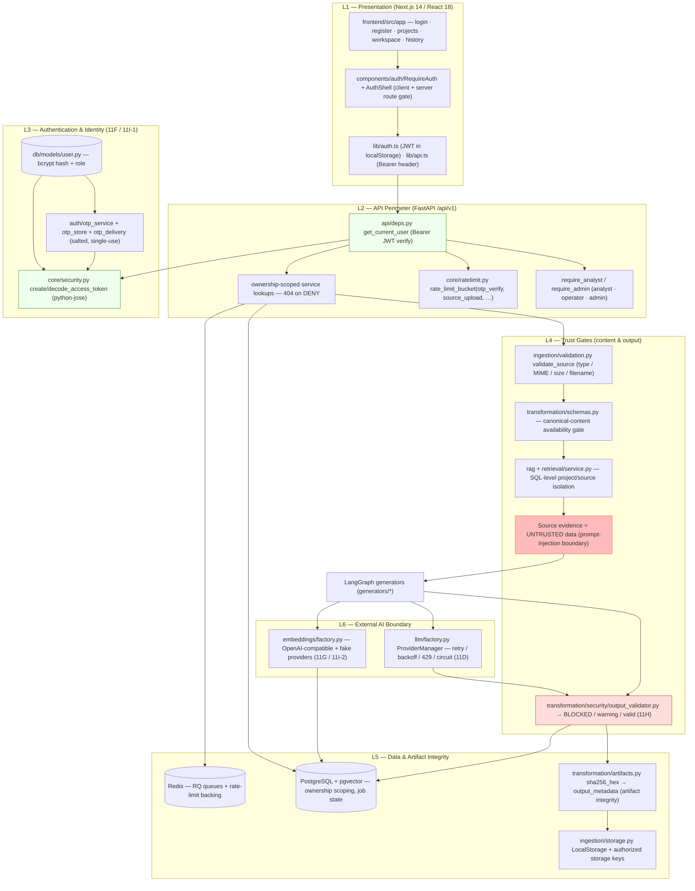

# TECH_STACK.md

## TransformIQ — Gen AI Platform for Automated Content Transformation

**Platform Edition:** Enterprise v2.0
**Version:** 2.0
**Status:** Implemented stack — verified from the repository (requirements.txt, worker/requirements.txt, frontend/package.json, docker-compose.yml)
**Supersedes:** v1.0 "Approved for MVP planning" (retains constraints that are still in force, §4)

> This document reflects what is **actually pinned and running** today, not a target
> stack. Everything listed is traceable to a dependency file or a tested module. Ground
> truth for live test counts: `docs/test_report.md` (backend 794 passed / 1 skipped,
> frontend 171 passed).

---

## 1. Implemented Stack by Layer

| Layer | Technology (pinned) | Status |
|---|---|---|
| Frontend framework | Next.js **14.2.18** + React **18.3.1** | Implemented |
| Frontend language | TypeScript **5.7.2** | Implemented |
| UI styling | Tailwind CSS **3.4.17** (+ PostCSS/Autoprefixer) | Implemented |
| UI components | Radix UI + shadcn/ui-style (class-variance-authority, tailwind-merge, lucide-react) | Implemented |
| Frontend testing | Jest **29.7.0**, ts-jest, @testing-library/react **16.1.0** + user-event + jest-dom | Implemented |
| Backend framework | FastAPI **0.115.6** + Uvicorn **0.32.1** | Implemented |
| Backend language | Python (see §2 for pinned versions) | Implemented |
| Config / validation | Pydantic **2.10.4** + pydantic-settings **2.7.0** | Implemented |
| Structured logging | structlog **24.4.0** | Implemented |
| Orchestration (AI graph) | LangGraph **0.2.60** (`GraphState`, `StateGraph`) + langchain-core **0.3.29** | Implemented |
| LLM integration | Provider-agnostic adapter: OpenAI-compatible (langchain-openai **0.3.0** / openai **1.59.6**), Gemini, deterministic Fake; resilience via 11D `ProviderManager` | Implemented |
| Embeddings | OpenAI-compatible provider + deterministic Fake, factory + retry ceiling (11G / 11I-2) | Implemented |
| Database | PostgreSQL (pg16, `pgvector/pgvector:pg16` image); SQLite (aiosqlite) for dev/tests | Implemented |
| Vector search | pgvector **0.3.6** — `VECTOR(1536)` column in `source_chunks` | Implemented |
| ORM / migrations | SQLAlchemy **2.0.36** (async) + Alembic **1.14.0** | Implemented |
| Background jobs | Redis **5.2.1** + RQ **2.0.0** (7 queues; 605 s job timeout) | Implemented |
| File storage | Local storage adapter (`LocalStorage`) on a Docker volume; keys `projects/{id}/sources/…`, `…/outputs/{id}/…` | Implemented |
| Document processing | PyMuPDF **1.25.1** (PDF), python-docx **1.1.2** (DOCX) | Implemented |
| Presentation / media | python-pptx **1.0.2**; deterministic renderers (PPTX, PNG+PDF infographic, PDF+SRT video package) | Implemented |
| Containerization | Docker + Docker Compose (5 services: postgres, redis, backend, worker, frontend) | Implemented |
| Backend testing | pytest **8.3.4** (+ pytest-asyncio, pytest-cov) | Implemented |
| CI/CD | None in repo (`/.github/workflows` absent) — treated as PENDING | Pending |
| Cloud provider | Not selected — application remains portable | Pending |

---

## 2. Pinned Backend Dependencies

Web: `fastapi==0.115.6`, `uvicorn[standard]==0.32.1`
Validation: `pydantic==2.10.4`, `pydantic-settings==2.7.0`
Logging: `structlog==24.4.0`
DB: `sqlalchemy[asyncio]==2.0.36`, `asyncpg==0.30.0`, `alembic==1.14.0`, `psycopg2-binary==2.9.10`
Vector: `pgvector==0.3.6`
Queue: `redis==5.2.1`, `rq==2.0.0`
HTTP client: `httpx==0.28.1`
Auth: `python-jose[cryptography]==3.3.0`, `passlib[bcrypt]==1.7.4`, `python-multipart==0.0.20`
Documents: `pymupdf==1.25.1`, `python-docx==1.1.2`
AI: `langchain-core==0.3.29`, `langgraph==0.2.60`, `langchain-openai==0.3.0`, `openai==1.59.6`, `tiktoken==0.8.0`
Presentation: `python-pptx==1.0.2`
Resilience: `tenacity==9.0.0`
Testing: `pytest==8.3.4`, `pytest-asyncio==0.24.0`, `pytest-cov==6.0.0`, `aiosqlite==0.20.0`

---

## 3. Security Stack (verified modules)

| Concern | Mechanism | Module |
|---|---|---|
| Passwordless login | Time-limited, single-use OTP; salted HMAC digests; rate-limited verify | `app/auth/otp_service.py`, `otp_store.py`, `otp_delivery.py` |
| Bearer authentication | JWT create/decode (python-jose) | `app/core/security.py` |
| API enforcement | `get_current_user` Bearer check; dev bypass gated behind `DEV_AUTH_BYPASS` (dev-only) | `app/api/deps.py` |
| Role-based access | Roles `analyst`/`operator`/`admin`; `require_analyst`/`require_admin` | `app/api/deps.py`, `app/api/v1/admin.py` |
| Object ownership | Ownership-scoped lookups; `404` (not `403`) on DENY | `app/api/v1/*`, service layer |
| Rate limiting | Token-bucket buckets (`otp_verify`, `source_upload`, …) | `app/core/ratelimit.py` |
| Ingestion gate | Type/MIME/size/filename/empty validation | `app/ingestion/validation.py` |
| RAG security | SQL-level project/source isolation; evidence treated as untrusted data | `app/rag/`, `app/retrieval/service.py`, ARCHITECTURE.md §9 |
| Output gate (11H) | Deterministic `BLOCKED`/`warning`/`valid` verdicts, no LLM/network | `app/transformation/security/output_validator.py` |
| Artifact integrity | Per-artifact SHA-256 digests in `output_metadata` (not a ledger) | `app/transformation/artifacts.py` |
| Worker isolation | Ownership-integrity re-check in worker; 605 s job timeout single-sourced | `worker/worker.py`, `app/core/config.py` |

---

## 4. Layered Security Architecture

---

## 5. Constraints Still in Force (from v1)

1. Secrets come from environment variables, never the repo (`.env.example`, never `.env`).
2. AI providers stay replaceable through the provider-agnostic adapter.
3. LLM outputs are schema validated (Pydantic `extra="forbid"` + 11H output-security verdict).
4. Rendering is deterministic — no LLM in renderers.
5. Long-running work is asynchronous (RQ worker), never inside the HTTP request.
6. Verification is an AI-assisted quality mechanism, not a guarantee of factual correctness.
7. Avoid introducing technologies not listed here without a requirement.
8. Explicitly avoided unless a real requirement appears: Kubernetes, Kafka, multiple
   relational/vector DBs, custom foundation-model training, multi-agent swarms, extra
   microservices, extra frontend frameworks/UI libraries, self-hosted LLM infra.

## 6. Documented Gaps (see also ARCHITECTURE.md §21–§22, §24)

- No OCR, malware/PII/secret scanning, reranker, or ANN index.
- Video output is a structured MVP package (PDF + SRT), not MP4.
- No GitHub Actions workflows; production deployment, SSO/MFA, and secrets manager are
  pending. Artifact SHA-256 hashing is implemented; a chained audit ledger is not.